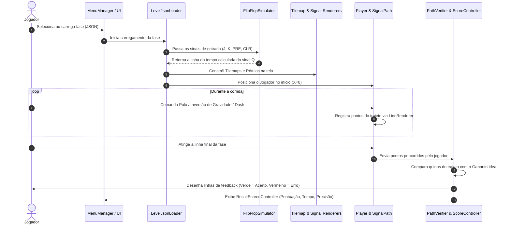

[← Voltar para a página inicial](../README.md)

---

# 🚀 Visão Geral e Arquitetura do Projeto: Flip'n Flop

Bem-vindo à documentação oficial do **Flip'n Flop**! Este documento foi elaborado para que qualquer pessoa (desenvolvedor, designer ou educador) consiga entender rapidamente o conceito do jogo, sua arquitetura de código, fluxo de execução e como contribuir.

---

## 📋 Sumário
1. [O que é o Flip'n Flop?](#1-o-que-é-o-flipn-flop)
2. [Conceitos do Jogo e Mecânicas](#2-conceitos-do-jogo-e-mecânicas)
3. [Estrutura de Pastas do Repositório](#3-estrutura-de-pastas-do-repositório)
4. [Arquitetura de Código (Módulos C#)](#4-arquitetura-de-código-módulos-c)
5. [Fluxo de Execução de uma Fase](#5-fluxo-de-execução-de-uma-fase)
6. [Integração WebGL e Customização](#6-integração-webgl-e-customização)
7. [Padrões de Código e Boas Práticas](#7-padrões-de-código-e-boas-práticas)
8. [Documentações Relacionadas](#8-documentações-relacionadas)

---

## 1. O que é o Flip'n Flop?

O **Flip'n Flop** é um jogo educativo 2D que combina elementos de **Plataforma e Puzzle** com conceitos de **Eletrônica Digital**. 

O objetivo principal é ensinar o funcionamento prático de **Flip-Flops** (JK, D, T, SR) e **Diagramas de Tempo**. O jogador assume o controle de um personagem em corrida horizontal contínua que precisa alternar sua gravidade entre o chão (nível lógico `0`) e o teto (nível lógico `1`) para desenhar a forma de onda correta correspondente à saída lógica \(Q\) do circuito.

---

## 2. Conceitos do Jogo e Mecânicas

### 🎮 Gameplay Central
- **Corrida e Gravidade:** O personagem avança no eixo X. Pressionar a ação de gravidade faz o personagem inverter de orientação (chão \(\rightarrow\) teto ou teto \(\rightarrow\) chão).
- **Sinal de Trajetória (`SignalPath`):** Conforme o jogador se move, um `LineRenderer` registra o caminho percorrido no espaço.
  - **Chão (Bottom Tilemap):** Representa o nível lógico **Baixo (0)**.
  - **Teto (Top Tilemap):** Representa o nível lógico **Alto (1)**.
- **Rótulos dos Sinais:** Os sinais digitais de entrada (J, K, Clock, Preset, Clear) são desenhados na tela com rótulos visuais sincronizados com os ciclos de tempo.
- **Dicas Visuais (`Hint`):** O jogador pode ativar linhas verticais guia nos momentos exatos das bordas de clock (`rising` ou `falling`) ou overlays de operação.

### 📐 Simulação Lógica
- Cada fase é definida por um arquivo **JSON** (`LevelData`).
- As entradas digitais mudam ao longo do tempo (divididas em passos de tempo / ciclos de clock).
- O simulador de Flip-Flop interno (`FlipFlopSimulator`) calcula a saída lógica ideal esperada \(Q\) em cada borda de subida/descida do clock e em eventos assíncronos (Preset e Clear).

---

## 3. Estrutura de Pastas do Repositório

```text
FlipNflop/
├── Assets/
│   ├── .agents/          # Arquivos de contexto e regras mandatória para Assistentes de IA
│   ├── Animations/       # Animações de personagem e objetos do jogo
│   ├── Arts/             # Sprites 2D, texturas e elementos visuais
│   ├── Materials/        # Materiais URP e Shaders
│   ├── Prefab/           # Prefabs (Jogador, Obstáculos, UI Elementos)
│   ├── Resources/        # Fases JSON nativas e recursos carregáveis via script
│   ├── Scenes/           # Cenas Unity (MainMenu, GameScene)
│   ├── Scripts/          # Código-fonte C# organizado modularmente
│   └── UI Toolkit/       # Documentos de UI (.uxml) e estilos (.uss)
├── Docs/                 # Documentação em Markdown para desenvolvedores
├── Packages/             # Pacotes de dependência do Unity (Input System, URP, Localization)
└── ProjectSettings/      # Configurações do projeto Unity
```

---

## 4. Arquitetura de Código (`Assets/Scripts/`)

A pasta `Assets/Scripts/` é dividida em 6 subdomínios totalmente modulares:

```text
Assets/Scripts/
├── Common/       # Utilitários compartilhados (Controle de Câmera, Captura de Tela)
├── Hint/         # Sistema de dicas visuais em tempo real (Linhas de Clock, Overlays)
├── Level/        # Dados da fase, simulação de Flip-Flops, carregamento e Tilemaps
│   ├── Loading/  # Leitura de JSON, sequência de fases e interop WebGL
│   ├── Obstacles/# Spawning e patrulha de obstáculos (Maces giratórias)
│   └── Rendering/# Renderização de terrenos, rótulos de sinais e efeito Parallax
├── Menus/        # Interfaces UI Toolkit (Menu Principal, Pausa, Resultados)
├── Player/       # Física do jogador, geração do rastro, gabarito e cálculo de pontuação
└── Settings/     # Configurações de cores acessíveis, áudio, vídeo e remapeamento de teclas
```

### Detalhamento dos Componentes Chave

| Módulo | Script Principal | Responsabilidade |
| :--- | :--- | :--- |
| **Level** | [`FlipFlopSimulator.cs`](file:///D:/Projetos/FlipNflop/Assets/Scripts/Level/FlipFlopSimulator.cs) | Núcleo matemático/lógico. Simula transições síncronas (borda de clock) e assíncronas (PRE/CLR). |
| **Level** | [`LevelJsonLoader.cs`](file:///D:/Projetos/FlipNflop/Assets/Scripts/Level/Loading/LevelJsonLoader.cs) | Carrega o JSON da fase, invoca o simulador e aciona a renderização dos Tilemaps e Rótulos. |
| **Level** | [`TilemapRenderer.cs`](file:///D:/Projetos/FlipNflop/Assets/Scripts/Level/Rendering/TilemapRenderer.cs) | Converte padrões de sinais (3 bits) nos tiles gráficos correspondentes do cenário. |
| **Player** | [`PlayerController.cs`](file:///D:/Projetos/FlipNflop/Assets/Scripts/Player/PlayerController.cs) | Controla físicas, gravidade, pulo, dash, colisões com inimigos e animações do personagem. |
| **Player** | [`GabaritoGenerator.cs`](file:///D:/Projetos/FlipNflop/Assets/Scripts/Player/GabaritoGenerator.cs) | Converte os eventos lógicos do simulador nas coordenadas exatas de quinas no mundo Unity. |
| **Player** | [`PathVerifier.cs`](file:///D:/Projetos/FlipNflop/Assets/Scripts/Player/PathVerifier.cs) | Compara o trajeto feito pelo jogador contra o gabarito ideal e gera feedback gráfico (verde/vermelho). |
| **Player** | [`ScoreController.cs`](file:///D:/Projetos/FlipNflop/Assets/Scripts/Player/ScoreController.cs) | Avalia a taxa de acerto do trajeto, aplica penalidades de tempo e calcula a pontuação final. |
| **Settings** | [`SignalColorManager.cs`](file:///D:/Projetos/FlipNflop/Assets/Scripts/Settings/SignalColorManager.cs) | Gerencia a paleta de cores dos sinais lógicos (suporta acessibilidade/daltonismo). |

---

## 5. Fluxo de Execução de uma Fase

Abaixo está o ciclo de vida completo de uma fase no jogo, desde o clique no menu até a tela de resultados:



---

## 6. Integração WebGL e Customização

O **Flip'n Flop** foi construído com suporte nativo a builds **WebGL** para execução em navegadores:
- **Upload Dinâmico de Fases:** Em builds WebGL, o jogador pode carregar arquivos `.json` diretamente do seu computador usando a ponte WebGL nativa (`UploadMenuManager.cs`).
- **Internacionalização (i18n):** O jogo utiliza o pacote **Unity Localization** para alternar facilmente os textos entre Português e Inglês nas telas de UI Toolkit e nas descrições.

---

## 7. Padrões de Código e Boas Práticas

Todos os scripts C# do repositório seguem rigorosamente o padrão documentado em **[`Assets/.agents/csharp_coding_standards.md`](file:///D:/Projetos/FlipNflop/Assets/.agents/csharp_coding_standards.md)**:

1. **Documentação XML em Inglês (`/// <summary>`)**:
   - Todo método e classe possui comentário descritivo em inglês.
   - Resumos explicitam dependências e conexões externas com outros scripts.
2. **Ausência de Comentários em Português**:
   - Nenhum comentário em português deve permanecer no código C#.
   - Comentários in-line no meio dos métodos são mantidos apenas quando estritamente necessários.
3. **Atributos de Inspetor em Inglês**:
   - Todos os atributos `[Header("...")]` e `[Tooltip("...")]` devem ser em inglês.
4. **Organização por Blocos `#region`**:
   - Scripts devem utilizar `#region` e `#endregion` nomeados em inglês para agrupar campos, métodos do ciclo de vida Unity, APIs públicas e auxiliares.

---

## 8. Documentações Relacionadas

Para mais detalhes sobre aspectos específicos do projeto, consulte:

- 🧩 **[Como Criar Seus Próprios Níveis (`CriandoNiveis.md`)](file:///D:/Projetos/FlipNflop/Docs/CriandoNiveis.md)**: Guia completo para criação e sintaxe dos arquivos JSON de fases.
- 🔄 **[Fluxo de Versionamento e Releases (`Versionamento.md`)](file:///D:/Projetos/FlipNflop/Docs/Versionamento.md)**: Padrão Git Flow, Conventional Commits e automações do GitHub Actions.
- ⚙️ **[Diretrizes C# para Agents (`csharp_coding_standards.md`)](file:///D:/Projetos/FlipNflop/Assets/.agents/csharp_coding_standards.md)**: Normas detalhadas de escrita de código C#.

---

> *Em caso de dúvidas ou sugestões de melhoria nesta documentação, abra uma issue ou envie um pull request seguindo as diretrizes de versionamento do projeto.*
